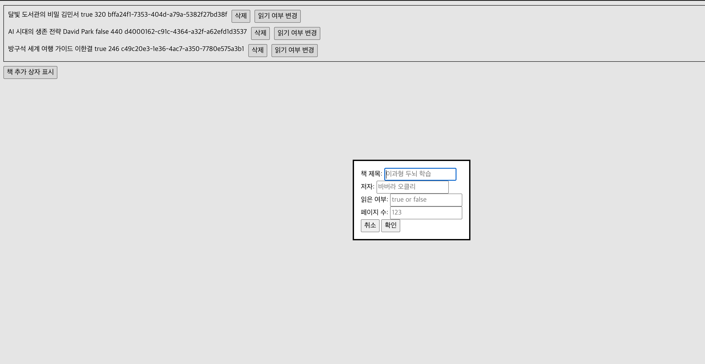

# Library (도서관)

바닐라 자바스크립트로 만든 간단한 책 관리 웹 앱입니다. 도서관에 책을 추가하고,
읽음/안 읽음 상태를 표시하고, 필요 없는 책은 삭제할 수 있습니다. 이 프로젝트는
**데이터**(책 객체)와 **화면 표시**(책을 페이지에 그리는 방식)를 분리하는 데
초점을 맞췄습니다.

> [The Odin Project](https://www.theodinproject.com/) 커리큘럼의 일부입니다.

## 데모 (Live Demo)

[사이트 바로 가기](https://jhoncarmack.github.io/Project_Library/)

## 스크린샷



## 주요 기능

- 모달 폼으로 새 책 추가 (제목, 저자, 페이지 수, 읽음 여부)
- 각 책을 개별 카드 형태로 표시
- 클릭 한 번으로 읽음 / 안 읽음 상태 전환
- 도서관에서 원하는 책 삭제
- 각 책에 고유하고 안정적인 ID 부여
- DOM에서 실시간으로 작동

## 사용 기술

- HTML5
- CSS3
- JavaScript (ES6+)

## 시작하기

저장소를 클론한 뒤 브라우저에서 열기만 하면 됩니다. 빌드 과정이나 별도의
의존성 설치가 필요 없습니다.

```bash
git clone https://github.com/Jhoncarmack/Project_Library
cd Project_Library
```

이후 `index.html`을 직접 열거나, 간단한 로컬 서버로 실행하세요.

```bash
# Python 3
python -m http.server

# 또는 Node 사용 시
npx serve
```

## 설계 개요

`myLibrary`가 데이터의 원본입니다. 모든 책 정보를 담고 있는 배열이고,
`displayBooks()`는 그 배열을 읽어서 화면에 그리는 역할만 할 뿐 원본을
건드리지 않습니다.

그래서 책을 추가·삭제하거나 읽음 상태를 바꿀 때는 항상 원본 배열을 먼저 변경한 뒤
화면을 다시 그립니다.

- **추가**: `addBookToLibrary()`로 새 책을 배열에 넣습니다.
- **삭제**: `filter()`로 해당 책을 제외한 새 배열을 만들어 교체합니다.
- **토글**: `Book.prototype`의 메서드로 해당 책의 `read` 값을 변경합니다.

화면 구조는 다음과 같습니다.

```

    book-list (책 목록)
    └ book-card (책 한 권)
        ├ book-info (정보)
        ├ 삭제 버튼
        └ 토글 버튼

```

## 배운 점

### 변수 명명의 중요성

이번 프로젝트를 진행하면서 변수 명명이 무엇보다 중요하다는 것을 깨달았다.
변수명이 제대로 붙어 있어야 코드가 읽기 쉬워지고, 나중에 내가 무엇을 하고 있는지
파악하기도 쉬웠다. "이 부분에서 이 함수를 부르면 원하는 동작을 하겠구나"라는 흐름이
자연스럽게 보였고, 코드에 대한 이해도가 올라가면서 코드 자체가 하나의 스토리처럼
읽힌다는 것을 알게 됐다.

### 프로토타입과 this

프로토타입을 처음 사용해 보면서, 프로토타입에 정의한 함수 안에서는 `this`를 통해
동작이 이루어진다는 것을 알았다. `this`는 호출한 객체를 가리키기 때문에, 그것만
따라가면 되어 훨씬 이해하기 쉬웠다. 읽음 여부를 변경할 때도 `book.readToggle()`로
호출하면 해당 book의 `read`만 정확히 바꿀 수 있었다.

## 감사의 말

- 프로젝트 과제를 제공한 [The Odin Project](https://www.theodinproject.com/)

## 만든 사람

**Jhoncarmack** — [GitHub](https://github.com/Jhoncarmack)
